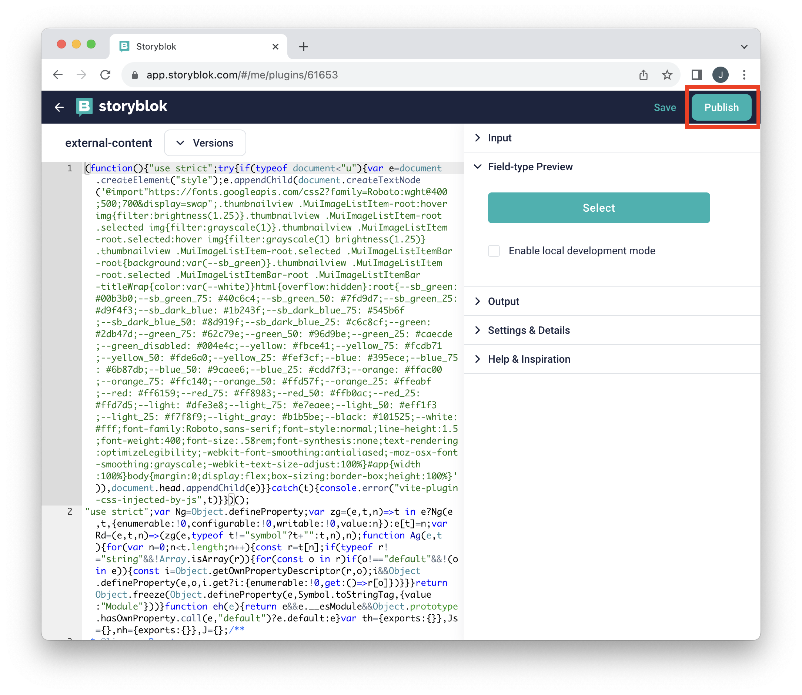

# Plugin deployment

1. Go to plugin directory `cd src/plugin`

2. Build plugin with `npm run build`

3. Deploy plugin to Storyblok with `npm run deploy`

4. Answer questions, update if prompted

   Example output:

   ```
   > @storyblok-external-content/plugin@1.0.1 deploy
   > npm run build && npx @storyblok/field-plugin-cli@beta deploy --name external-content

   > @storyblok-external-content/plugin@1.0.1 build
   > tsc && vite build

   vite v4.4.9 building for production...
   ✓ 1052 modules transformed.

     Deploy the plugin to production with:

       npm run deploy

   dist/index.html    0.51 kB │ gzip:   0.34 kB
   dist/index.js    361.67 kB │ gzip: 115.72 kB
   ✓ built in 1.52s

   Welcome!
   Let's deploy a field-plugin.

   ✔ Where to deploy the plugin? › My Plugins
   [info] Plugin name: `external-content`
   [info] Checking existing field plugins...
   ✔ You want to deploy a new field plugin `external-content`? … yes
   [SUCCESS] The field plugin is deployed successfully.
   You can find the deployed plugin at the following URL:
     > https://app.storyblok.com/#/me/plugins/61653
   You can also find it in "My account > My Plugins" at the bottom of the sidebar.
   ```

5. Navigate to the provided URL

   ```
   You can find the deployed plugin at the following URL:
     > https://app.storyblok.com/#/me/plugins/61653
   ```

6. Publish latest version
   
