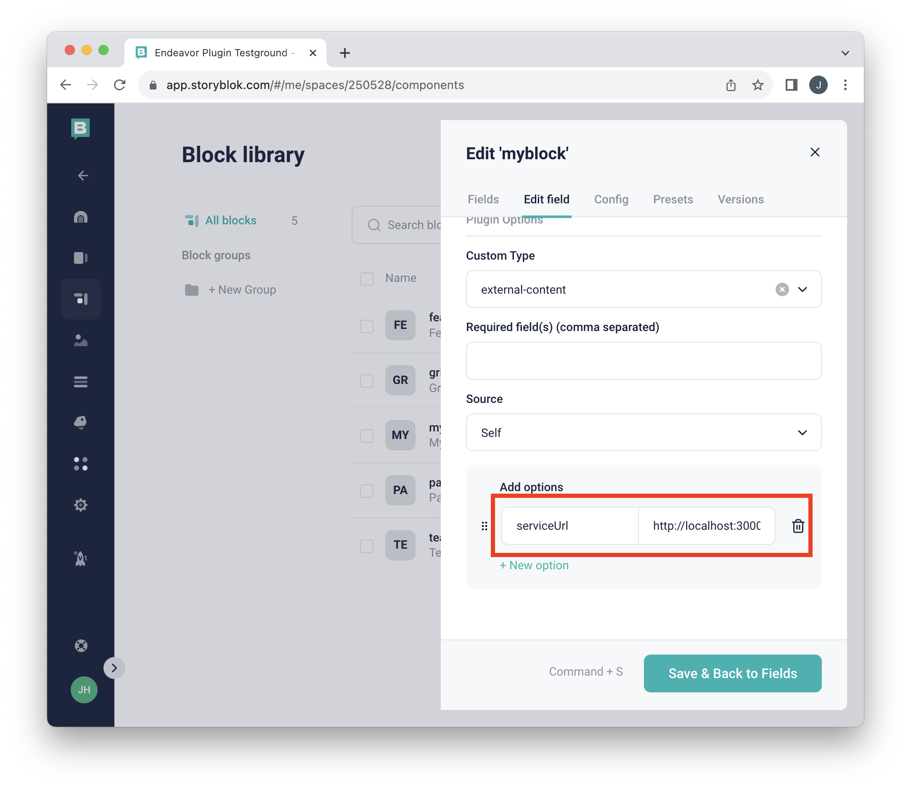

# Plugin setup

1. Open "Block Library" in Storyblok from the side panel
   

2. Click "New Block"
   

3. Type in desired "Technical name" and click "Add Block"
   

4. Fill in field "Name"
   

5. Set type to "Plugin". Scroll to end of the list or filter by typing in "plugin"
   
   

6. Click "Add"
   

7. Edit the new field
   

8. Check that "Field type" is set to "Plugin"
   

9. Set "Custom Type" to "external-content"
   

10. Set serviceUrl option
    

11. Click "Save & Back to Fields"
    

12. You have now added new block with a content field.
