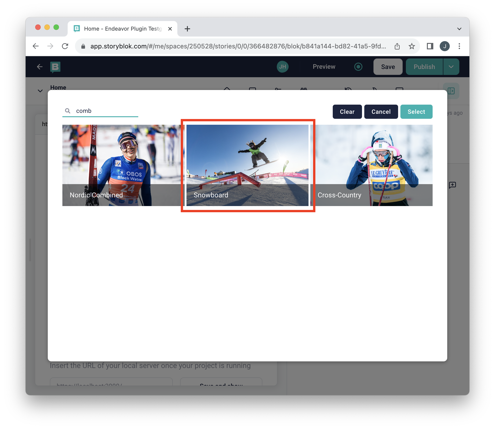

# Plugin usage

1. Open "Content" section
   

2. Select page to edit
   

3. Add block to page
   

4. Select block with the content field
   

5. Open the block
   

6. Click "Select" to open content picker
   

7. Filter contents
   

8. Click content to select it
   

9. Click "Select" to confirm selection
   

10. You have now added content to the page
    
