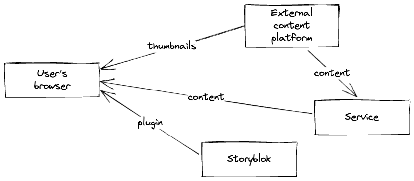

# STORYBLOK EXTERNAL CONTENT FIELD PLUGIN

Field plugins are embedded into the Storyblok Visual Editor via iframes, allowing them to function as standalone applications within the editor environment. These plugins are hosted on Storyblok's infrastructure. The plugin code is compiled into a single JavaScript bundle by the developer and then uploaded to the Storyblok platform.

This particular field plugin is designed to interact with an external content platform to fetch a list of available content, including their IDs, titles, and thumbnail URLs. It's worth noting that these thumbnails are fetched directly from the platform by the user's browser.

## Usage

1. clone this repository
2. Go to repo directory `cd storyblok-external-content`
3. Select matching node version with `nvm use` or `nvm install`
4. Install dependencies with `npm ci`

### Service

To implement authentication and format content appropriately, you're required to create a service. Use the provided [Service](./src/service/) as a foundational template for this purpose.

To publish service package use `npm run publish:patch`

### Plugin deployment

For a brief overview of the necessary steps, refer to the list below. For comprehensive guidelines, please consult the [Plugin Deployment documentation.](./doc/plugin-deployment.md)

1. Go to plugin directory `cd src/plugin`
2. Build plugin with `npm run build`
3. Deploy plugin to Storyblok with `npm run deploy`
4. Publish latest version from Storyblok UI

### Plugin setup

For a brief overview of the necessary steps, refer to the list below. For comprehensive guidelines, please consult the [Plugin Setup documentation.](./doc/plugin-setup.md)

1. Open block library in Storyblok
2. Create new Block
3. Add plugin field
4. Set custom type as "external-content"
5. Set serviceUrl option

### Plugin usage

For a brief overview of the necessary steps, refer to the list below. For comprehensive guidelines, please consult the [Plugin Usage documentation.](./doc/plugin-usage.md)

1. Insert block
2. Select content from popup

## Resources

- [Introduction to Field Plugins](https://www.storyblok.com/docs/plugins/field-plugins/introduction)
- [Storyblok Field Plugin CLI](https://www.npmjs.com/package/@storyblok/field-plugin-cli)
